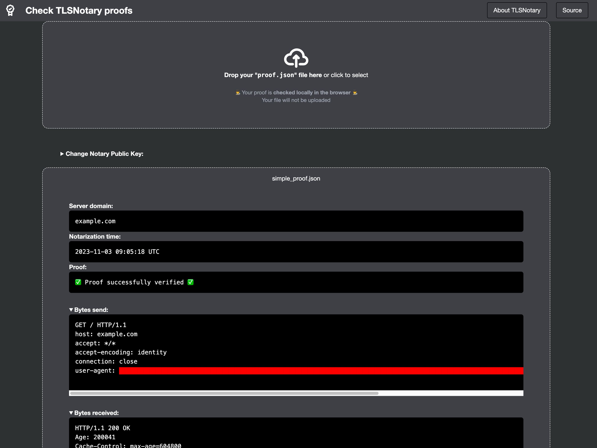

<figure>
  
</figure>

# Progcrypto 2023: TLSNotary workshop

## TLSNotary in Rust

### Install Rust

If you don't have `rust` installed yet, install it with [rustup](https://rustup.rs/):
```shell
curl --proto '=https' --tlsv1.2 -sSf https://sh.rustup.rs | sh
```

### Clone workshop repository

Clone this repository first

```shell
git clone git@github.com:heeckhau/progcrypto_workshop.git
```

### Simple example: Notarize public data from example.com

TODO intro

https://example.com/

#### Notarize

Notarize <https://example.com/>

1. Start a simple Notary server:
  ```shell
  cd tlsn/tlsn/examples/simple
  cargo run --release --example simple_notary
  ```
  The `Notary` server will now be running in the background waiting for connections from a `Prover`. You can switch to another console to run the `Prover`.

2. Run a simple prover

```shell
cargo run --release --bin simple_prover
```

Note: you can also run the `simple_prover` by clicking the **▶️ Run** button in VS Code. However, this will run without the `--release` by default and the execution will be a lot slower.


If the notarization went file you should see this output in the console
```log
Listening on: 127.0.0.1:8080
Connected to the Notary
Accepted connection from: 127.0.0.1:64072
Starting an MPC TLS connection with the server
Got a response from the server
Notarization completed successfully!
The proof has been written to `simple_proof.json`
```

3. Verify the proof

When you open `simple_proof.json` in an editor, you will see a json file with lots of non-human readable byte arrays. You can decode this file by running:

```shell
cargo run --release --bin simple_verifier
```

This will output the TLS=transaction in clear text:
```log
Successfully verified that the bytes below came from a session with Dns("example.com") at 2023-11-03 08:48:20 UTC.
Note that the bytes which the Prover chose not to disclose are shown as X.

Bytes sent:
...
```

4. Redact

Open `simple_prover.rs` and locate the line with:
```rust
    let redact = false;
```
and change it to
```rust
    let redact = true;
```

Next, if you run the `simple_prover` and `simple_verifier` again, you'll notice redacted `X`'s in the output:
```shell
cargo run --release --bin simple_prover
cargo run --release --bin simple_verifier
```

```log
<!doctype html>
<html>
<head>
    <title>XXXXXXXXXXXXXX</title>
...
```

You can also use <https://tlsnotary.github.io/proof_viz/> to inspect your proofs.
Open <https://tlsnotary.github.io/proof_viz/> and drag and drop `simple_proof.json` from your file explorer into the drop zone.


Redacted bytes are marked with <span style="color:red">red █ characters</span>.

Experiments:
- [ ] Modify the `server_name` (or any other data) in `simple_proof.json` and verify the proof is no longer valid
- [ ] Modify `build_proof_with_redactions` function in `simple_prover.rs` to redact more or different data


### Notarize Discord message

#### Notarize

#### Redact

#### Verify

## TLSNotary browser extension

### Install browser extension

### Notarize twitter account access

#### Notarize

#### Redact

#### Verify

## TLSNotary your private data

Try to notarize data from:
* Amazon purchase
* Twitter dm
* LinkedIn skill
* Steam accomplishment
* Garmin.connect achievement
* AirBnB score
* Booking.com Genius level
* Tesla ownership
